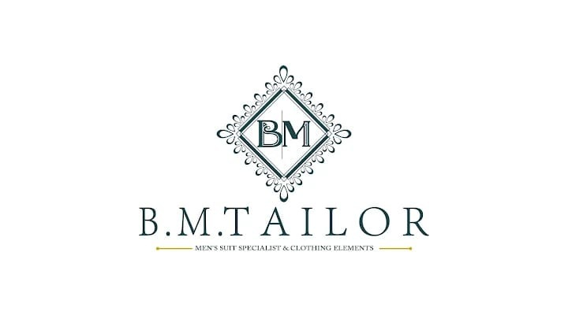

<div align="center">



# B.M. TAILOR
### *Crafting Confidence Since 1990*
**Men's Suit Specialist & Clothing Elements • Jaipur, Rajasthan**

[](https://nextjs.org/)
[](https://www.typescriptlang.org/)
[](https://tailwindcss.com/)
[](https://www.prisma.io/)
[](#)

</div>

---

## 🏛️ About B.M. TAILOR

Established in 1990 in Jaipur, Rajasthan, **B.M. TAILOR** is a premier tailoring house and menswear brand combining three decades of Rajasthani craftsmanship with modern European tailoring aesthetics. 

This platform is a production-grade e-commerce application, bespoke appointment portal, institutional uniform quoting system, and master atelier administration dashboard.

---

## ✨ Key Capabilities

### 1. Ready-Made E-Commerce Storefront
- Dynamic multi-attribute filtering (Category, Size, Color, Fabric, Occasion, Price).
- Real-time stock status, low-stock indicators, and variant selectors.
- Shopping bag with instant coupon discount validation (`ROYAL10`, `JAIPUR500`).
- Address validation with Jaipur Pincode detection and COD convenience fee calculations.
- Strict **Non-Exchangeable COD policy** banners and 7-day ready-made exchange requests.
- Printable, future-ready **Tax / Retail Invoices** with optional GSTIN and HSN `6203`.

### 2. Bespoke Custom Tailoring (7-Step Configurator)
- Interactive silhouette customization (Two-piece, Three-piece, Tuxedo, Jodhpuri Bandhgala, Sherwani).
- Fabric selection, lapel, cuff, button, and trouser styling.
- Direct store appointment scheduling and WhatsApp atelier consultation triggers.

### 3. Royal Wedding Collection
- Curated wedding ensembles for grooms and celebratory occasions.
- Dedicated consultation booking workflow for Jaipur bridal/groom appointments.

### 4. Institutional Uniforms Manufacturing
- Bulk inquiry quotation builder serving 8 institutional sectors: Schools, Colleges, Hospitals, Hotels, Restaurants, Security, Industrial Factories, and Corporate firms.

### 5. Sensitive Customer Measurement Vault
- Encrypted and private personal measurement profiles saved directly in the customer account.
- Garment-specific measurement fields (Chest, Shoulder, Sleeve, Waist, Inseam, etc.) with visual measurement guides.

### 6. Master Administration Portal
- **Dashboard**: Paid revenue metrics, pending dispatches, low-stock warnings, and appointment schedules.
- **Product Catalogue**: Manage garment specifications, pricing, stock levels, and feature toggles (Best Seller, Featured, Active).
- **Inventory Ledger**: Real-time stock levels with workshop restock triggers and audit-logged adjustments.
- **Appointment Manager**: Atelier visit tracking and confirmation workflows.
- **Uniform Quotations**: Review, status tracking, and notes on institutional orders.
- **Review Moderation Queue**: Zero Fake Reviews moderation queue (Approve / Reject / Delete).
- **CMS & Placeholders**: Direct content management for Brand Heritage stories, Homepage banners, and Jaipur branch coordinates.

---

## 🛠️ Technology Stack

- **Framework**: Next.js 14.2 (App Router, Server & Client Components)
- **Language**: TypeScript
- **Styling**: Tailwind CSS with custom royal heritage theme tokens
- **Database & ORM**: Prisma ORM with SQLite (compatible with PostgreSQL / MySQL)
- **Validation**: Zod
- **Icons**: Lucide React
- **Bilingual Support**: English & हिंदी (Hindi) contextual translation engine

---

## 🚀 Getting Started

### 1. Clone the Repository
```bash
git clone https://github.com/Developer-Satish-27/bm-tailors.git
cd bm-tailors
```

### 2. Install Dependencies
```bash
npm install
```

### 3. Setup Database & Seed Initial Data
```bash
npx prisma db push
node prisma/seed.js
```

### 4. Start Development Server
```bash
npm run dev
```
Open [http://localhost:3000](http://localhost:3000) in your browser.

### 5. Build for Production
```bash
npm run build
npm run start
```

---

## 🔐 Demo Credentials

| Role | Email | Password | Access Level |
| :--- | :--- | :--- | :--- |
| **Admin Atelier Portal** | `admin@bmtailors.com` | `BMTailors@Admin1990!` | Full Admin Privileges |
| **Customer Demo Account** | `customer@bmtailors.com` | `Customer1990!` | Orders & Measurements |

---

## 📍 Business Information

- **Brand**: B.M. TAILOR
- **Heritage**: Established 1990
- **Location**: Jaipur, Rajasthan, India
- **Specialization**: Men's Suit Specialist & Clothing Elements

---

*Crafted with precision for B.M. TAILOR Jaipur.*
